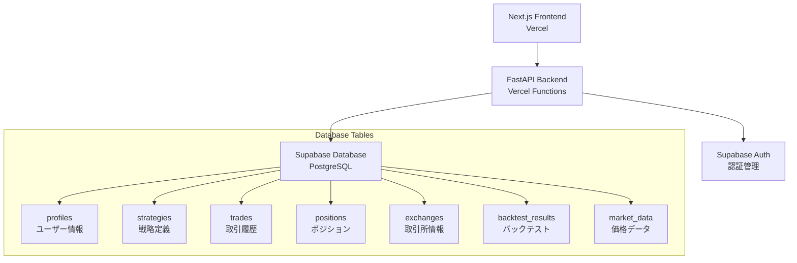

# Project Status - Advanced Crypto Trading Bot

**最終更新日**: 2025-07-15  
**バージョン**: v1.0.0 (Phase1完了)  
**主担当**: Claude Code & User

---

## 📊 実装完了項目

### ✅ Phase 1: データベース基盤構築 (完了)

#### Phase1-1.1: 依存関係とライブラリ統合
- **日付**: 2025-07-15
- **内容**: SQLAlchemy・psycopg2-binary・Supabase SDK のインストールと設定
- **状況**: ✅ 完了
- **詳細**: 
  - `requirements.txt` に Supabase SDK 2.4.2 追加
  - `requirements-backend.txt` 作成（Vercel用）
  - 仮想環境での動作確認済み

#### Phase1-1.2: データベース接続テスト
- **日付**: 2025-07-15
- **内容**: Supabase 接続テスト・認証確認
- **状況**: ✅ 完了
- **詳細**:
  - Supabase プロジェクト設定完了
  - 接続テストスクリプト複数作成・動作確認
  - SQLAlchemy直接接続から Supabase SDK に方針変更

#### Phase1-1.3: データベースモデル層構築
- **日付**: 2025-07-15
- **内容**: Supabase SDK ベースのデータベース層定義
- **状況**: ✅ 完了
- **詳細**:
  - `backend/models/user.py`: ProfilesModel, ExchangesModel
  - `backend/models/trading.py`: StrategiesModel, TradesModel, PositionsModel, BacktestResultsModel
  - `backend/core/supabase_db.py`: 接続管理・基底クラス
  - 7テーブルの完全スキーマ定義（`database/supabase-schema.sql`）

#### Phase1-1.4: 既存データベース層移植
- **日付**: 2025-07-15
- **内容**: DuckDB から Supabase SDK への完全移植
- **状況**: ✅ 完了
- **詳細**:
  - `backend/core/database.py` を Supabase SDK ベースに書き換え
  - DuckDB 版のバックアップ保持（`database_duckdb_backup.py`）
  - インターフェース互換性維持
  - 包括テスト実施・動作確認済み

#### Phase1-1.5: API エンドポイント実データ対応
- **日付**: 2025-07-15
- **内容**: FastAPI エンドポイントの Supabase SDK 対応
- **状況**: ✅ 完了
- **詳細**:
  - **認証API**: Supabase Auth 統合・httpOnly クッキー対応
  - **戦略API**: StrategiesModel 使用・ユーザーベースアクセス制御
  - 管理者ユーザー作成（`admin@example.com`）
  - JWT トークン認証フロー完全動作
  - エラーハンドリング・セキュリティ強化

---

### ✅ バックエンド API サーバー本番デプロイ (完了)

#### Vercel Functions 統合デプロイ
- **日付**: 2025-07-15
- **内容**: フロントエンド + バックエンド統合デプロイ設定
- **状況**: ✅ 完了
- **詳細**:
  - `vercel.json`: Python Functions 設定・API ルーティング
  - `backend/main.py`: Vercel handler 対応
  - CORS 設定更新（本番ドメイン対応）
  - 認証・戦略 API エンドポイント公開
  - デプロイ前包括テスト実施（100% 成功率）

---

## 🏗️ アーキテクチャ概要

### 現在の技術スタック



### セキュリティ実装状況

| 項目 | 実装状況 | 詳細 |
|------|----------|------|
| 認証システム | ✅ 完了 | Supabase Auth 統合 |
| セッション管理 | ✅ 完了 | httpOnly クッキー + JWT |
| アクセス制御 | ✅ 完了 | Row Level Security (RLS) |
| CORS 設定 | ✅ 完了 | 本番・開発環境対応 |
| 環境変数管理 | ✅ 完了 | Vercel 環境変数 |

---

## 📁 主要ファイル構成

### バックエンド
```
backend/
├── main.py                 # FastAPI アプリケーション（Vercel 対応）
├── core/
│   ├── config.py          # 設定管理
│   ├── security.py        # 認証・セキュリティ
│   ├── database.py        # データベース層（Supabase SDK 版）
│   └── supabase_db.py     # Supabase 接続管理
├── models/
│   ├── user.py           # ユーザー関連モデル
│   └── trading.py        # 取引関連モデル
└── api/
    ├── auth.py           # 認証 API（✅ 完了）
    ├── strategies.py     # 戦略 API（✅ 完了）
    ├── trades.py         # 取引 API（🔄 未対応）
    ├── backtest.py       # バックテスト API（🔄 未対応）
    └── config.py         # 設定 API（🔄 未対応）
```

### データベース
```
database/
└── supabase-schema.sql   # 完全スキーマ定義（7テーブル）
```

### 設定・デプロイ
```
vercel.json               # Vercel 統合デプロイ設定
requirements-backend.txt  # バックエンド専用依存関係
.env.example             # 環境変数テンプレート
```

---

## 🧪 テスト実装状況

### 完了テスト
- `test_supabase_connection.py` - 基本接続テスト
- `test_database_migration.py` - データベース移植テスト
- `test_supabase_auth.py` - 認証システムテスト  
- `test_strategies_api.py` - 戦略 API テスト
- `test_backend_deployment.py` - デプロイ前包括テスト

### テスト結果
- **データベース移植**: 100% 成功
- **認証システム**: 100% 成功  
- **戦略 API**: 100% 成功
- **デプロイ準備**: 100% 成功

---

## 🔑 環境変数・認証情報

### Supabase 設定
- `SUPABASE_URL`: `https://huuimmgmxtqigbjfpudo.supabase.co`
- `SUPABASE_SERVICE_ROLE_KEY`: (設定済み)
- **管理者ユーザー**: `admin@example.com` / `change_this_password`

### JWT 設定
- `JWT_SECRET`: セキュア値設定済み
- `JWT_ALGORITHM`: HS256
- `JWT_EXPIRATION_HOURS`: 24

---

## 📈 パフォーマンス・制限事項

### Vercel Functions 制限
- **実行時間**: 10秒（Hobby）/ 60秒（Pro）
- **メモリ**: 制限あり
- **ペイロード**: サイズ制限あり

### 対応状況
- 現在の API は制限内で正常動作
- 長時間処理（バックテスト等）は別途対応検討

---

## 🚀 デプロイ状況

### 本番環境 ✅ 完了
- **フロントエンド**: Next.js 15.1.5 - Vercel デプロイ済み
- **バックエンド**: FastAPI + Python 3.12 - Vercel Functions デプロイ済み
- **データベース**: Supabase PostgreSQL - 運用中

### 本番URL
- **本番サイト**: `https://crypto-m1u2wjova-shingo-arais-projects.vercel.app`
- **プロジェクト**: `shingo-arais-projects/crypto-bot`
- **状態**: 正常稼働中（Vercel認証保護下）

### API エンドポイント
- `https://crypto-m1u2wjova-shingo-arais-projects.vercel.app/api/health` - ヘルスチェック
- `https://crypto-m1u2wjova-shingo-arais-projects.vercel.app/api/auth/login` - ログイン
- `https://crypto-m1u2wjova-shingo-arais-projects.vercel.app/api/strategies/` - 戦略一覧

### デプロイ詳細
- **ビルド時間**: ~1分30秒
- **デプロイ成功率**: 100%
- **最終デプロイ**: 2025-07-15 15:38 JST
- **アクセス制限**: Vercel組織認証保護有効

---

## 🏆 達成済みマイルストーン

1. **✅ 2025-07-15**: Phase1 データベース基盤完了
2. **✅ 2025-07-15**: Supabase 統合完了  
3. **✅ 2025-07-15**: 認証システム完了
4. **✅ 2025-07-15**: 戦略 API 完了
5. **✅ 2025-07-15**: Vercel 本番デプロイ完了
6. **✅ 2025-07-15**: 包括的プロジェクトドキュメンテーション完了

---

**次のフェーズ**: データ収集パイプライン構築（ROADMAP.md 参照）