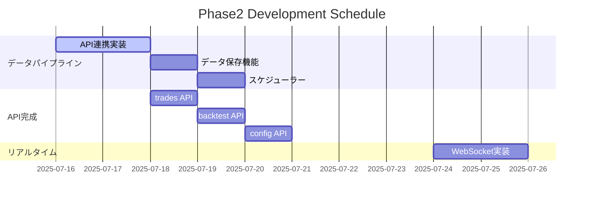

# Development Roadmap - Advanced Crypto Trading Bot

**最終更新日**: 2025-07-15  
**現在フェーズ**: Phase2 開始準備完了  
**次期マイルストーン**: データ収集パイプライン構築

---

## 🎯 今後の優先度付きタスク

### 🔥 高優先度 (Phase2: データパイプライン)

#### データ収集パイプライン構築 📊
- **期限**: 2025-07-16～17
- **担当**: 未定
- **内容**: 取引所API（Binance/Bybit）からOHLCVデータを取得してSupabaseに保存
- **詳細**:
  - 取引所 API 連携（CCXT ライブラリ使用）
  - `market_data` テーブルへのデータ保存
  - リアルタイム価格取得機能
  - データ取得スケジューラー実装
  - エラーハンドリング・リトライ機能
- **成功条件**: 1時間足データが自動取得・保存される

---

### 🟡 中優先度 (Phase2: API完成)

#### API エンドポイント実データ対応
- **期限**: 2025-07-18～19  
- **内容**: モックデータから実データ取得に変更 - trades.py と backtest.py の更新
- **詳細**:
  - `backend/api/trades.py`: TradesModel 使用に更新
  - `backend/api/backtest.py`: BacktestResultsModel 使用に更新
  - `backend/api/config.py`: 設定管理 API 実装
  - ユーザーベースアクセス制御統一
  - エラーハンドリング標準化

#### バックテスト機能動作確認と改善
- **期限**: 2025-07-20～21
- **内容**: 既存バックテストAPIの動作テストと最適化
- **詳細**:
  - 既存バックテストエンジン（`backend/backtesting/`）のSupabase対応
  - パフォーマンス最適化
  - Vercel Functions の実行時間制限内での動作確認
  - 大規模データ処理の代替案検討

#### 取引所API認証実装
- **期限**: 2025-07-22～23
- **内容**: 実際の取引所アカウントとの連携機能
- **詳細**:
  - 取引所 API キー暗号化保存
  - `exchanges` テーブル活用
  - API キーの安全な管理
  - 取引所別の設定管理

#### リアルタイム価格更新
- **期限**: 2025-07-24～25
- **内容**: WebSocket接続でリアルタイムデータ表示
- **詳細**:
  - WebSocket エンドポイント実装
  - フロントエンドのリアルタイム表示
  - 価格アラート機能
  - データ配信最適化

---

### 🟢 低優先度 (Phase3: 高度機能)

#### ライブ取引機能実装
- **期限**: 2025-07-28～30
- **内容**: 実際の注文執行機能（十分なテスト後）
- **詳細**:
  - 注文執行エンジン
  - リスク管理組み込み
  - 注文状況追跡
  - 緊急停止機能
- **前提条件**: 十分なバックテスト + ペーパートレード

#### リスク管理機能強化
- **期限**: 2025-08-01～03
- **内容**: ポジションサイズ、ストップロス、資金管理の実装
- **詳細**:
  - 動的ポジションサイジング
  - 自動ストップロス
  - 資金管理ルール
  - 最大ドローダウン制御

#### モニタリングとアラート機能
- **期限**: 2025-08-05～07
- **内容**: 取引結果の監視とアラート通知システム
- **詳細**:
  - パフォーマンス監視ダッシュボード
  - アラート通知（メール・Slack等）
  - 異常検知機能
  - 自動レポート生成

---

## 📋 フェーズ別詳細計画

### Phase2: データ駆動基盤 (2025-07-16～25)



#### マイルストーン
1. **データ取得開始** (7/17): 基本的な価格データ取得機能
2. **API統一完了** (7/21): 全エンドポイントのSupabase対応
3. **リアルタイム開始** (7/25): WebSocketでの価格配信

### Phase3: 高度機能 (2025-07-28～08-07)

#### 実装順序
1. バックテスト機能完全動作
2. ライブ取引機能（慎重実装）
3. リスク管理強化
4. モニタリング・アラート

---

## 🛠️ 技術的考慮事項

### Vercel Functions 制限対応

#### 問題
- 実行時間制限（10-60秒）
- メモリ制限
- 大量データ処理の困難

#### 対応策
1. **バックテスト**: 
   - 軽量化または外部サービス移行検討
   - Railway, Heroku 等での長時間処理
2. **データ収集**: 
   - バッチ処理の細分化
   - 外部cron使用検討
3. **リアルタイム処理**: 
   - WebSocket最適化
   - 必要最小限のデータ配信

### データベース設計拡張

#### 追加予定テーブル
```sql
-- 価格データ履歴
CREATE TABLE price_history (
    id UUID PRIMARY KEY DEFAULT gen_random_uuid(),
    symbol VARCHAR NOT NULL,
    timeframe VARCHAR NOT NULL,
    open_price DECIMAL(20, 8),
    high_price DECIMAL(20, 8),
    low_price DECIMAL(20, 8),
    close_price DECIMAL(20, 8),
    volume DECIMAL(20, 8),
    timestamp TIMESTAMPTZ NOT NULL,
    created_at TIMESTAMPTZ DEFAULT NOW()
);

-- アラート設定
CREATE TABLE price_alerts (
    id UUID PRIMARY KEY DEFAULT gen_random_uuid(),
    user_id UUID REFERENCES auth.users(id),
    symbol VARCHAR NOT NULL,
    condition_type VARCHAR NOT NULL, -- 'above', 'below', 'change'
    target_price DECIMAL(20, 8),
    is_active BOOLEAN DEFAULT TRUE,
    created_at TIMESTAMPTZ DEFAULT NOW()
);
```

---

## 📊 成功指標・KPI

### Phase2 完了基準
- [ ] 5種類以上の暗号通貨の1時間足データを24時間自動取得
- [ ] 全API エンドポイントが実データで正常動作
- [ ] WebSocket で 1秒以内の価格更新配信
- [ ] エラー率 < 1%

### Phase3 完了基準
- [ ] 模擬取引で 1か月間の連続稼働
- [ ] リスク管理機能で最大ドローダウン < 設定値
- [ ] アラート機能で 1分以内の異常通知

---

## 🚨 リスク管理計画

### 技術リスク
1. **Vercel制限問題**: 
   - 軽減策: 代替インフラ準備
   - 対応期限: Phase2 中に決定
2. **API制限・コスト**: 
   - 軽減策: レート制限実装
   - モニタリング: 使用量追跡

### 運用リスク
1. **データ品質**: 
   - 検証機能実装
   - 異常データ検知
2. **セキュリティ**: 
   - APIキー暗号化
   - アクセス制御強化

---

## 📅 今後の主要スケジュール

| 日付 | マイルストーン | 詳細 |
|------|---------------|------|
| 2025-07-17 | データ収集開始 | Binance/Bybit価格取得 |
| 2025-07-21 | API統一完了 | trades/backtest対応 |
| 2025-07-25 | リアルタイム配信 | WebSocket実装 |
| 2025-07-30 | ライブ取引準備 | 模擬取引開始 |
| 2025-08-07 | Phase3完了 | 全機能統合完了 |

---

## 🤝 貢献方法

新しいタスクに取り組む際は：

1. このロードマップを確認
2. `PROJECT_STATUS.md` で現状把握
3. `docs/GETTING_STARTED.md` で環境構築
4. 実装 → テスト → 文書更新
5. プルリクエスト作成

---

**次のアクション**: データ収集パイプライン構築から開始  
**担当者募集中**: 各フェーズのタスク  
**連絡先**: GitHub Issues で相談