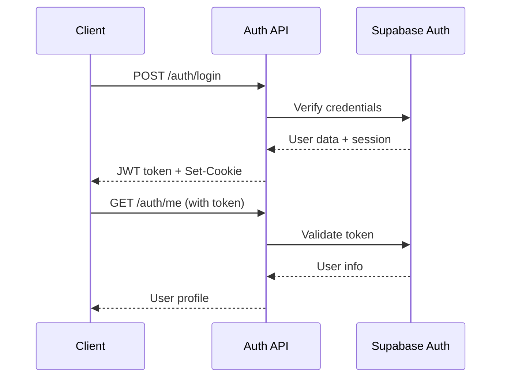

# API Reference - Advanced Crypto Trading Bot

本ドキュメントでは、暗号通貨取引ボットのバックエンドAPIの詳細仕様を説明します。

**Base URL**: `https://your-domain.vercel.app/api`  
**API Version**: v1.0  
**Authentication**: JWT Bearer Token  
**Content-Type**: `application/json`

---

## 🔐 認証

### 認証方式

すべてのプロテクトされたエンドポイントは、以下のいずれかの方法で認証が必要です：

1. **Authorization Header**:
   ```
   Authorization: Bearer <jwt_token>
   ```

2. **HTTP-Only Cookie** (推奨):
   ```
   Cookie: access_token=<jwt_token>
   ```

### 認証フロー



---

## 🔑 認証 API

### POST /auth/login

ユーザーのログイン認証を行います。

#### Request

```http
POST /auth/login
Content-Type: application/x-www-form-urlencoded

username=admin&password=your_password
```

#### Response

```json
{
  "access_token": "eyJhbGciOiJIUzI1NiIsInR5cCI6IkpXVCJ9...",
  "token_type": "bearer"
}
```

#### Headers

```
Set-Cookie: access_token=<token>; HttpOnly; Secure; SameSite=Strict; Max-Age=86400
```

#### Error Responses

| Status | Error | Description |
|--------|-------|-------------|
| 401 | `Incorrect username or password` | 認証情報が間違っている |
| 422 | `Validation Error` | リクエスト形式が間違っている |

---

### POST /auth/logout

ユーザーのログアウト処理を行います。

#### Request

```http
POST /auth/logout
```

#### Response

```json
{
  "message": "Successfully logged out"
}
```

#### Headers

```
Set-Cookie: access_token=; HttpOnly; Secure; SameSite=Strict; Max-Age=0
```

---

### GET /auth/me

現在のユーザー情報を取得します。

#### Request

```http
GET /auth/me
Authorization: Bearer <token>
```

#### Response

```json
{
  "id": "aa45c7c5-19f7-4e4d-a565-e74886ee1d09",
  "username": "admin",
  "role": "admin",
  "created_at": "2025-07-15T05:50:22.726096+00:00"
}
```

#### Error Responses

| Status | Error | Description |
|--------|-------|-------------|
| 401 | `Could not validate credentials` | トークンが無効または期限切れ |

---

### POST /auth/refresh

JWT トークンを更新します。

#### Request

```http
POST /auth/refresh
Authorization: Bearer <token>
```

#### Response

```json
{
  "access_token": "eyJhbGciOiJIUzI1NiIsInR5cCI6IkpXVCJ9...",
  "token_type": "bearer"
}
```

---

## 🎯 戦略管理 API

### GET /strategies/

現在のユーザーの戦略一覧を取得します。

#### Request

```http
GET /strategies/
Authorization: Bearer <token>
```

#### Response

```json
[
  {
    "id": "5179a2e7-0400-45b7-8d03-79dac1f751be",
    "user_id": "aa45c7c5-19f7-4e4d-a565-e74886ee1d09",
    "name": "BTC Momentum Strategy",
    "description": "ビットコインのモメンタム戦略",
    "parameters": {
      "symbol": "BTCUSDT",
      "timeframe": "1h",
      "ema_fast": 12,
      "ema_slow": 26
    },
    "is_active": true,
    "created_at": "2025-07-15T06:30:15.123456Z"
  }
]
```

---

### GET /strategies/{strategy_id}

特定の戦略の詳細情報を取得します。

#### Request

```http
GET /strategies/5179a2e7-0400-45b7-8d03-79dac1f751be
Authorization: Bearer <token>
```

#### Response

```json
{
  "id": "5179a2e7-0400-45b7-8d03-79dac1f751be",
  "user_id": "aa45c7c5-19f7-4e4d-a565-e74886ee1d09",
  "name": "BTC Momentum Strategy",
  "description": "ビットコインのモメンタム戦略",
  "parameters": {
    "symbol": "BTCUSDT",
    "timeframe": "1h",
    "ema_fast": 12,
    "ema_slow": 26,
    "risk_level": "medium"
  },
  "is_active": true,
  "created_at": "2025-07-15T06:30:15.123456Z"
}
```

#### Error Responses

| Status | Error | Description |
|--------|-------|-------------|
| 404 | `Strategy not found` | 戦略が存在しない |
| 403 | `Access denied` | 他のユーザーの戦略にアクセス |

---

### POST /strategies/

新しい戦略を作成します。

#### Request

```http
POST /strategies/
Authorization: Bearer <token>
Content-Type: application/json

{
  "name": "ETH Scalping Strategy",
  "description": "イーサリアムのスキャルピング戦略",
  "parameters": {
    "symbol": "ETHUSDT",
    "timeframe": "5m",
    "bb_period": 20,
    "bb_deviation": 2,
    "rsi_period": 14
  },
  "is_active": false
}
```

#### Response

```json
{
  "id": "new-uuid-here",
  "user_id": "aa45c7c5-19f7-4e4d-a565-e74886ee1d09",
  "name": "ETH Scalping Strategy",
  "description": "イーサリアムのスキャルピング戦略",
  "parameters": {
    "symbol": "ETHUSDT",
    "timeframe": "5m",
    "bb_period": 20,
    "bb_deviation": 2,
    "rsi_period": 14
  },
  "is_active": false,
  "created_at": "2025-07-15T06:45:23.789012Z"
}
```

#### Error Responses

| Status | Error | Description |
|--------|-------|-------------|
| 400 | `Failed to create strategy` | 作成処理に失敗 |
| 422 | `Validation Error` | リクエスト形式が間違っている |

---

### PATCH /strategies/{strategy_id}

既存の戦略を更新します。

#### Request

```http
PATCH /strategies/5179a2e7-0400-45b7-8d03-79dac1f751be
Authorization: Bearer <token>
Content-Type: application/json

{
  "description": "更新されたモメンタム戦略",
  "is_active": true,
  "parameters": {
    "symbol": "BTCUSDT",
    "timeframe": "1h",
    "ema_fast": 10,
    "ema_slow": 21
  }
}
```

#### Response

```json
{
  "id": "5179a2e7-0400-45b7-8d03-79dac1f751be",
  "user_id": "aa45c7c5-19f7-4e4d-a565-e74886ee1d09",
  "name": "BTC Momentum Strategy",
  "description": "更新されたモメンタム戦略",
  "parameters": {
    "symbol": "BTCUSDT",
    "timeframe": "1h",
    "ema_fast": 10,
    "ema_slow": 21
  },
  "is_active": true,
  "created_at": "2025-07-15T06:30:15.123456Z"
}
```

---

## 💹 取引 API (実装予定)

### GET /trades/

ユーザーの取引履歴を取得します。

#### Request

```http
GET /trades/?limit=50&offset=0&symbol=BTCUSDT
Authorization: Bearer <token>
```

#### Response

```json
[
  {
    "id": "trade-uuid",
    "user_id": "user-uuid",
    "strategy_id": "strategy-uuid",
    "symbol": "BTCUSDT",
    "side": "buy",
    "type": "market",
    "amount": 0.01,
    "price": 45000.00,
    "fee": 0.05,
    "timestamp": "2025-07-15T07:00:00Z"
  }
]
```

### POST /trades/

新しい取引を実行します。

#### Request

```http
POST /trades/
Authorization: Bearer <token>
Content-Type: application/json

{
  "symbol": "BTCUSDT",
  "side": "buy",
  "type": "market",
  "amount": 0.01,
  "strategy_id": "strategy-uuid"
}
```

---

## 📊 バックテスト API (実装予定)

### POST /backtest/run

バックテストを実行します。

#### Request

```http
POST /backtest/run
Authorization: Bearer <token>
Content-Type: application/json

{
  "strategy_id": "strategy-uuid",
  "start_date": "2024-01-01",
  "end_date": "2024-12-31",
  "initial_capital": 10000
}
```

#### Response

```json
{
  "backtest_id": "backtest-uuid",
  "status": "running",
  "estimated_completion": "2025-07-15T07:10:00Z"
}
```

### GET /backtest/{backtest_id}

バックテスト結果を取得します。

#### Response

```json
{
  "id": "backtest-uuid",
  "strategy_id": "strategy-uuid",
  "start_period": "2024-01-01",
  "end_period": "2024-12-31",
  "results_data": {
    "total_return": 0.15,
    "sharpe_ratio": 1.2,
    "max_drawdown": 0.08,
    "total_trades": 156,
    "win_rate": 0.62
  },
  "created_at": "2025-07-15T07:00:00Z"
}
```

---

## 🏥 ヘルスチェック API

### GET /health

API サーバーの状態を確認します。

#### Request

```http
GET /health
```

#### Response

```json
{
  "status": "healthy",
  "timestamp": "2025-07-15T07:00:00Z",
  "version": "1.0.0"
}
```

### GET /

API のルート情報を取得します。

#### Response

```json
{
  "message": "Crypto Bot API is running",
  "version": "1.0.0",
  "docs": "/docs"
}
```

---

## 📝 共通レスポンス形式

### 成功レスポンス

```json
{
  "data": { ... },
  "message": "Success",
  "timestamp": "2025-07-15T07:00:00Z"
}
```

### エラーレスポンス

```json
{
  "detail": "Error message",
  "error_code": "VALIDATION_ERROR",
  "timestamp": "2025-07-15T07:00:00Z"
}
```

### バリデーションエラー

```json
{
  "detail": [
    {
      "loc": ["body", "amount"],
      "msg": "ensure this value is greater than 0",
      "type": "value_error.number.not_gt",
      "ctx": {"limit_value": 0}
    }
  ]
}
```

---

## 🚦 レート制限

| エンドポイント | 制限 | 期間 |
|---------------|------|------|
| `/auth/login` | 5 requests | 1 minute |
| `/strategies/*` | 100 requests | 1 minute |
| `/trades/*` | 50 requests | 1 minute |
| その他 | 200 requests | 1 minute |

レート制限に達した場合:

```http
HTTP/1.1 429 Too Many Requests
Content-Type: application/json

{
  "detail": "Rate limit exceeded",
  "retry_after": 60
}
```

---

## 📱 SDK・クライアント例

### JavaScript/TypeScript

```typescript
class CryptoBotAPI {
  private baseURL = 'https://your-domain.vercel.app/api';
  private token: string | null = null;

  async login(username: string, password: string) {
    const response = await fetch(`${this.baseURL}/auth/login`, {
      method: 'POST',
      headers: { 'Content-Type': 'application/x-www-form-urlencoded' },
      body: `username=${username}&password=${password}`,
      credentials: 'include'
    });
    
    const data = await response.json();
    this.token = data.access_token;
    return data;
  }

  async getStrategies() {
    const response = await fetch(`${this.baseURL}/strategies/`, {
      headers: { 'Authorization': `Bearer ${this.token}` },
      credentials: 'include'
    });
    
    return response.json();
  }
}
```

### Python

```python
import requests

class CryptoBotAPI:
    def __init__(self, base_url: str):
        self.base_url = base_url
        self.session = requests.Session()
    
    def login(self, username: str, password: str):
        response = self.session.post(
            f"{self.base_url}/auth/login",
            data={"username": username, "password": password}
        )
        response.raise_for_status()
        
        data = response.json()
        self.session.headers.update({
            "Authorization": f"Bearer {data['access_token']}"
        })
        return data
    
    def get_strategies(self):
        response = self.session.get(f"{self.base_url}/strategies/")
        response.raise_for_status()
        return response.json()
```

---

## 🔧 開発・テスト

### API ドキュメント

開発中は FastAPI の自動生成ドキュメントが利用可能です：

- **Swagger UI**: `http://localhost:8000/docs`
- **ReDoc**: `http://localhost:8000/redoc`
- **OpenAPI JSON**: `http://localhost:8000/openapi.json`

### テスト用 cURL コマンド

```bash
# ログイン
curl -X POST "https://your-domain.vercel.app/api/auth/login" \
  -H "Content-Type: application/x-www-form-urlencoded" \
  -d "username=admin&password=your_password"

# 戦略一覧取得
curl -X GET "https://your-domain.vercel.app/api/strategies/" \
  -H "Authorization: Bearer <your_token>"

# 戦略作成
curl -X POST "https://your-domain.vercel.app/api/strategies/" \
  -H "Authorization: Bearer <your_token>" \
  -H "Content-Type: application/json" \
  -d '{
    "name": "Test Strategy",
    "description": "Test strategy description",
    "parameters": {"symbol": "BTCUSDT"},
    "is_active": false
  }'
```

---

**この API リファレンスにより、フロントエンドやサードパーティアプリケーションから効率的にバックエンドと連携できます。**