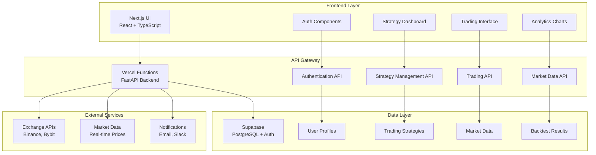
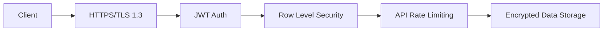
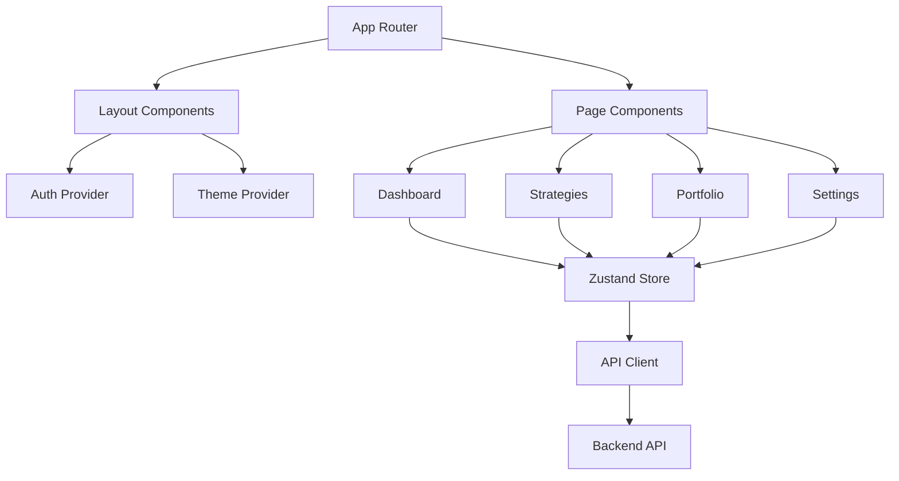
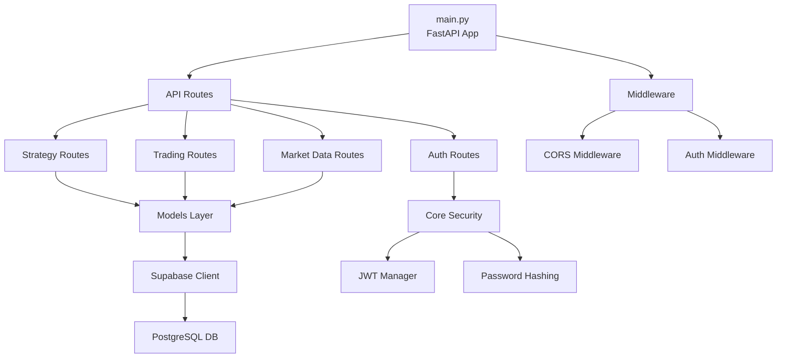
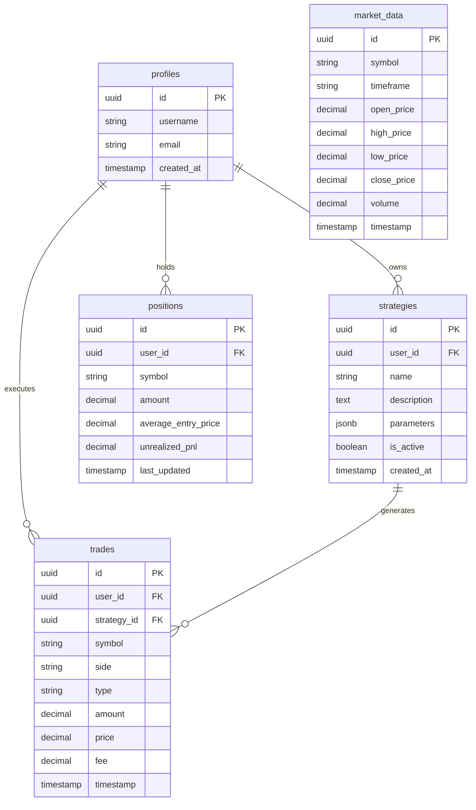
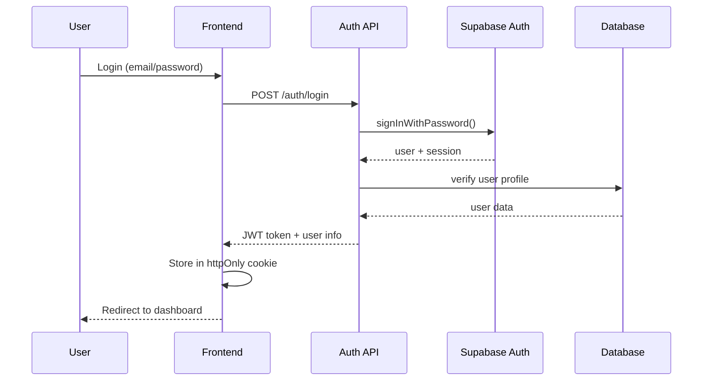
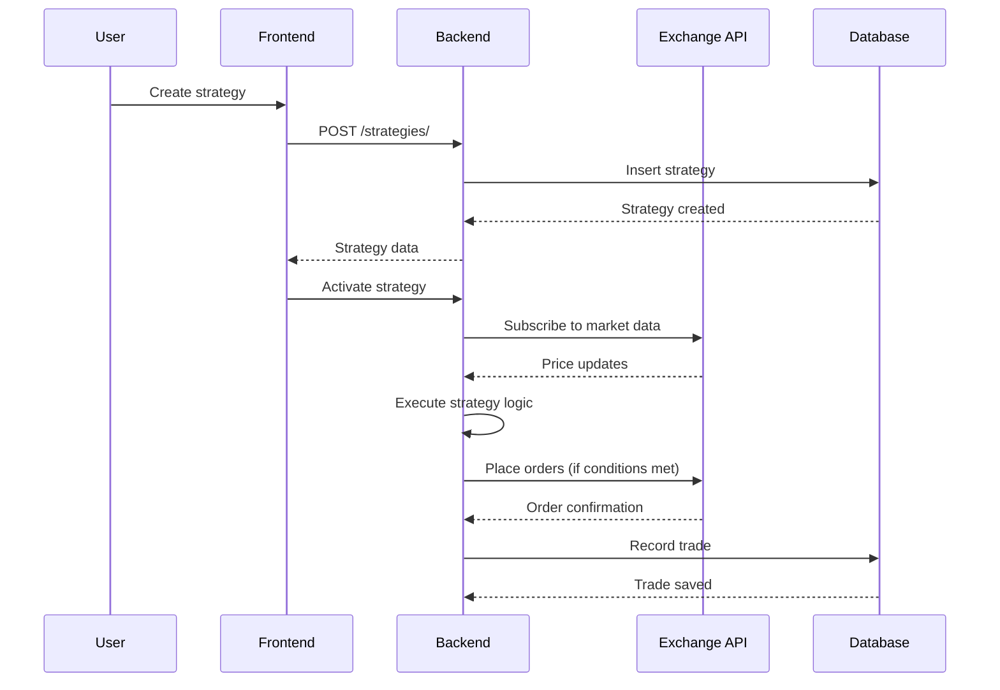
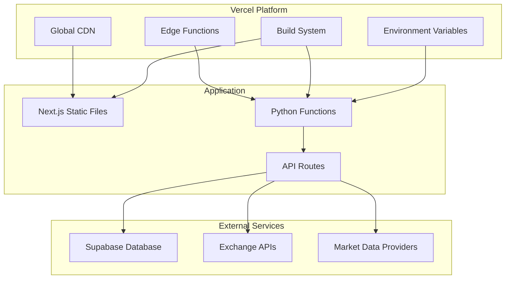
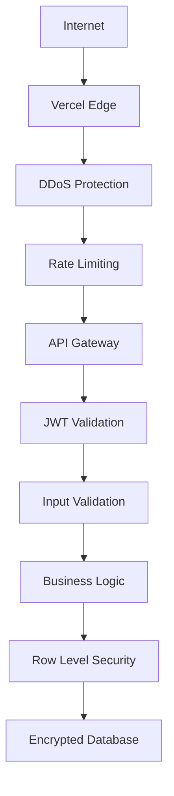
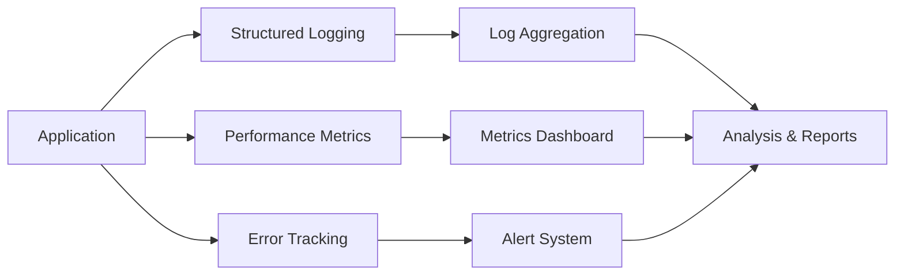

# System Architecture - Advanced Crypto Trading Bot

本ドキュメントでは、暗号通貨取引ボットのシステム全体の設計思想、アーキテクチャ、技術選択の理由を説明します。

**最終更新**: 2025-07-15  
**バージョン**: v1.0 (Supabase統合版)

---

## 🏗️ 全体アーキテクチャ

### システム概要図



---

## 🎯 設計思想

### 1. クラウドファースト設計

**原則**: すべてのコンポーネントをクラウドネイティブで設計

**理由**:
- **スケーラビリティ**: 需要に応じた自動スケーリング
- **可用性**: 99.9% アップタイム保証
- **運用コスト**: インフラ管理の自動化
- **グローバル展開**: CDN による高速配信

**実装**:
- フロントエンド: Vercel (Global CDN)
- バックエンド: Vercel Functions (Serverless)
- データベース: Supabase (Managed PostgreSQL)
- 認証: Supabase Auth (OAuth + JWT)

### 2. セキュリティファースト

**原則**: すべてのレイヤーでセキュリティを強化

**実装**:


### 3. モジュラー設計

**原則**: 疎結合・高凝集のマイクロサービス風設計

**利点**:
- 独立した開発・デプロイ
- 技術スタックの柔軟性
- 障害の局所化
- テストの容易性

---

## 💻 技術スタック詳細

### フロントエンド技術選択

| 技術 | バージョン | 選択理由 |
|------|-----------|----------|
| **Next.js** | 14.x | App Router, SSR/SSG, API統合 |
| **React** | 18.x | コンポーネント再利用性、豊富なエコシステム |
| **TypeScript** | 5.x | 型安全性、開発者体験向上 |
| **Tailwind CSS** | 3.x | 高速UI開発、一貫性のあるデザイン |
| **Zustand** | 4.x | 軽量状態管理、TypeScript親和性 |

#### フロントエンド アーキテクチャ



### バックエンド技術選択

| 技術 | バージョン | 選択理由 |
|------|-----------|----------|
| **FastAPI** | 0.109.x | 高性能、自動API文書生成、型ヒント |
| **Python** | 3.12 | データサイエンス豊富なライブラリ |
| **Supabase SDK** | 2.4.x | PostgreSQL統合、リアルタイム機能 |
| **Pydantic** | 2.x | データバリデーション、設定管理 |
| **CCXT** | 4.x | 取引所API統一インターフェース |

#### バックエンド レイヤー構造



---

## 🗄️ データベース設計

### Supabase 選択理由

1. **PostgreSQL ベース**: ACID準拠、SQL標準対応
2. **リアルタイム機能**: WebSocket による即座のデータ同期
3. **Row Level Security**: テーブルレベルでのアクセス制御
4. **自動API生成**: RESTful API の自動生成
5. **認証統合**: OAuth, JWT の標準実装

### データベース設計原則



### Row Level Security (RLS) 実装

```sql
-- Users can only access their own data
CREATE POLICY "Users can view own data" ON strategies
FOR SELECT USING (auth.uid() = user_id);

CREATE POLICY "Users can insert own data" ON strategies  
FOR INSERT WITH CHECK (auth.uid() = user_id);

CREATE POLICY "Users can update own data" ON strategies
FOR UPDATE USING (auth.uid() = user_id);
```

---

## 🔄 データフロー

### 認証フロー



### 戦略実行フロー



---

## 🚀 デプロイメント アーキテクチャ

### Vercel Serverless 統合



### 環境分離

| 環境 | URL | データベース | 用途 |
|------|-----|-------------|------|
| **Development** | localhost:3000 | Local Supabase | 開発・テスト |
| **Staging** | staging.vercel.app | Staging DB | 統合テスト |
| **Production** | app.vercel.app | Production DB | 本番運用 |

---

## ⚡ パフォーマンス最適化

### フロントエンド最適化

1. **Code Splitting**: Route-based lazy loading
2. **Image Optimization**: Next.js Image component
3. **CSS Optimization**: Tailwind CSS purging
4. **Bundle Optimization**: Tree shaking, minification

### バックエンド最適化

1. **Connection Pooling**: Supabase 自動管理
2. **Query Optimization**: インデックス設計
3. **Caching Strategy**: Redis 検討（将来実装）
4. **Rate Limiting**: API abuse 防止

### データベース最適化

```sql
-- Critical indexes for performance
CREATE INDEX idx_trades_user_timestamp ON trades (user_id, timestamp DESC);
CREATE INDEX idx_market_data_symbol_timeframe ON market_data (symbol, timeframe, timestamp DESC);
CREATE INDEX idx_strategies_user_active ON strategies (user_id, is_active);
```

---

## 🔐 セキュリティ アーキテクチャ

### 多層防御戦略



### 認証・認可システム

1. **Multi-Factor Authentication**: Email + Password + OTP（将来実装）
2. **JWT Token**: 短時間有効期限 + Refresh token
3. **Role-Based Access Control**: Admin, Trader, Viewer roles
4. **API Key Management**: 取引所APIキーの暗号化保存

---

## 📊 監視・ログ戦略

### アプリケーション監視



### 実装済み監視

- **Logging**: 構造化ログ（JSON形式）
- **Health Checks**: `/health` エンドポイント
- **Error Handling**: 統一エラーレスポンス
- **Performance**: API response time tracking

---

## 🔮 将来の拡張計画

### Phase 2: 高度機能

1. **Machine Learning**: 価格予測モデル
2. **Portfolio Optimization**: リスクパリティ
3. **Multi-Exchange**: 複数取引所対応
4. **Mobile App**: React Native 実装

### Phase 3: エンタープライズ

1. **Multi-Tenant**: 複数組織対応
2. **Advanced Analytics**: BI ダッシュボード
3. **Compliance**: 規制対応・監査機能
4. **High Frequency**: マイクロ秒取引対応

---

## 📚 参考資料・標準

### 設計標準
- **REST API**: OpenAPI 3.0 準拠
- **Database**: PostgreSQL 標準SQL
- **Security**: OWASP Top 10 対応
- **Authentication**: OAuth 2.0 + OpenID Connect

### ドキュメント
- [API Reference](./API_REFERENCE.md)
- [Database Schema](./DATABASE_SCHEMA.md)  
- [Getting Started](./GETTING_STARTED.md)

---

**この設計により、スケーラブルで安全な暗号通貨取引システムを実現しています。**