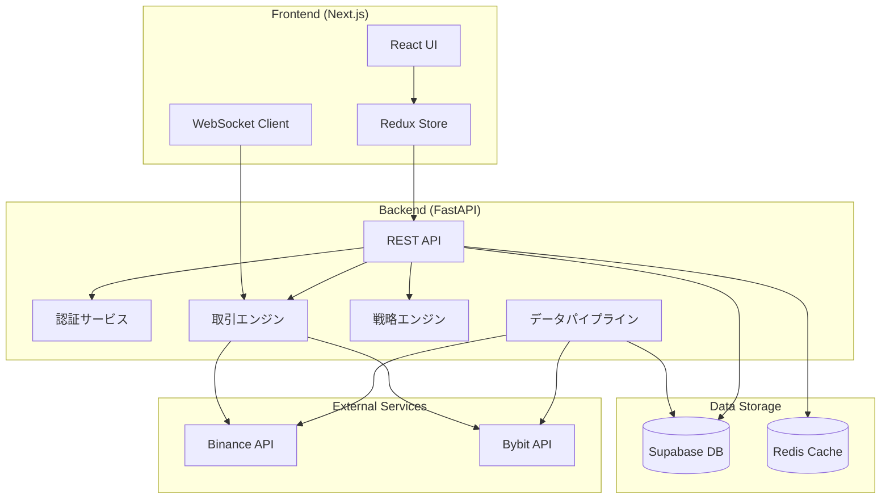

# 🏗️ Architecture Overview

Advanced Crypto Trading Botのシステムアーキテクチャと設計思想について説明します。

## 📊 システム構成図



## 🎯 設計原則

### 1. **モジュラー設計**

- 各コンポーネントは独立して開発・テスト可能
- 疎結合による柔軟な拡張性

### 2. **スケーラビリティ**

- 水平スケーリングを前提とした設計
- ステートレスなAPIサーバー

### 3. **セキュリティファースト**

- JWT認証による安全なAPI通信
- 環境変数による機密情報管理
- ロールベースアクセス制御（RBAC）

## 🔧 技術スタック

### Backend

- **Framework**: FastAPI (Python 3.11+)
- **ORM**: SQLAlchemy
- **Database**: PostgreSQL (Supabase)
- **Cache**: Redis
- **Task Queue**: Celery
- **WebSocket**: FastAPI WebSocket

### Frontend

- **Framework**: Next.js 14
- **UI Library**: React 18
- **State Management**: Redux Toolkit
- **Styling**: Tailwind CSS
- **Charts**: TradingView Lightweight Charts

### Infrastructure

- **Container**: Docker
- **CI/CD**: GitHub Actions
- **Monitoring**: Prometheus + Grafana
- **Logging**: ELK Stack

## 📁 プロジェクト構造

```
crypto-bot/
├── backend/
│   ├── api/              # APIエンドポイント
│   ├── core/             # 共通機能（DB、認証、設定）
│   ├── models/           # データモデル
│   ├── strategies/       # 取引戦略
│   ├── exchanges/        # 取引所接続
│   ├── backtesting/      # バックテストエンジン
│   ├── data_pipeline/    # データ収集
│   └── trading/          # 取引実行エンジン
├── frontend/
│   ├── components/       # Reactコンポーネント
│   ├── pages/           # Next.jsページ
│   ├── store/           # Redux Store
│   ├── hooks/           # カスタムフック
│   └── utils/           # ユーティリティ関数
└── tests/               # テストコード
```

## 🔄 データフロー

### 1. **価格データ収集フロー**

```
取引所API → DataPipeline → 検証・正規化 → Supabase DB
                          ↓
                    Redis Cache (最新データ)
```

### 2. **取引実行フロー**

```
戦略エンジン → シグナル生成 → リスク管理 → 注文実行 → 取引所API
                           ↓              ↓
                      ポジション管理   取引記録DB
```

### 3. **リアルタイム更新フロー**

```
取引所WebSocket → Backend WebSocket Server → Frontend WebSocket Client
                                          ↓
                                    UIリアルタイム更新
```

## 🛡️ セキュリティアーキテクチャ

### 認証・認可

- **JWT Bearer Token**: APIアクセス認証
- **Refresh Token**: トークン更新機構
- **RBAC**: ユーザー権限管理

### APIキー管理

```python
# 暗号化されたAPIキーの保存
encrypted_key = encrypt(api_key, master_key)
store_in_db(user_id, encrypted_key)

# 使用時の復号
api_key = decrypt(encrypted_key, master_key)
```

### 通信セキュリティ

- HTTPS通信の強制
- CORS設定による不正アクセス防止
- Rate Limiting実装

## 🔌 拡張ポイント

### 1. **新規取引所の追加**

`AbstractExchangeAdapter`を継承して実装：

```python
class NewExchangeAdapter(AbstractExchangeAdapter):
    def get_ticker(self, symbol: str) -> Ticker:
        # 実装

    def place_order(self, order: Order) -> OrderResult:
        # 実装
```

### 2. **新規戦略の追加**

`BaseStrategy`を継承して実装：

```python
class NewStrategy(BaseStrategy):
    def calculate_signals(self, data: pd.DataFrame) -> List[Signal]:
        # 実装
```

### 3. **新規インジケーターの追加**

`indicators/`モジュールに追加して、戦略から利用

## 🚀 パフォーマンス最適化

### 1. **キャッシング戦略**

- 価格データ: Redis (TTL: 1分)
- ユーザー情報: Redis (TTL: 30分)
- 計算結果: メモリキャッシュ

### 2. **非同期処理**

- FastAPIの非同期エンドポイント
- Celeryによるバックグラウンドタスク
- 非同期DB接続プール

### 3. **データベース最適化**

- インデックスの適切な設定
- パーティショニング（時系列データ）
- コネクションプーリング

## 📈 スケーリング戦略

### Horizontal Scaling

```yaml
# docker-compose.yml
services:
  backend:
    scale: 3 # 3インスタンス起動

  nginx:
    # ロードバランサー設定
```

### Vertical Scaling

- リソース要求に応じたコンテナサイズ調整
- データベース接続数の調整

## 🔍 監視とロギング

### メトリクス収集

```python
# Prometheusメトリクス例
order_execution_time = Histogram(
    'order_execution_seconds',
    'Time spent executing orders'
)
```

### ログ設計

```python
# 構造化ログ
logger.info(
    "Order executed",
    extra={
        "order_id": order.id,
        "symbol": order.symbol,
        "side": order.side,
        "execution_time": time_elapsed
    }
)
```

---

このアーキテクチャは、高可用性、拡張性、保守性を考慮して設計されています。
