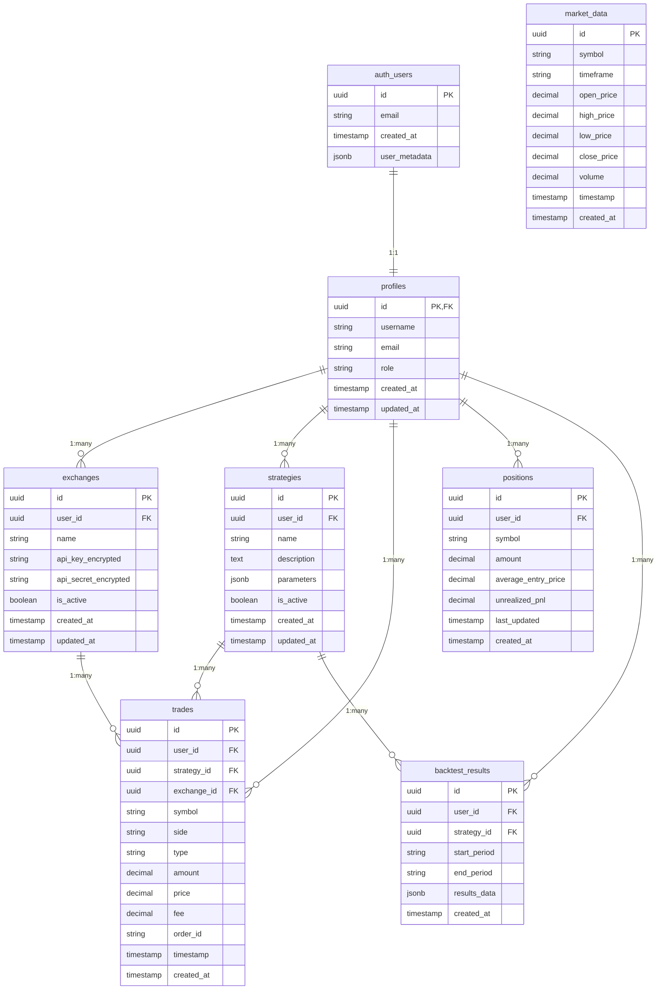

# Database Schema - Advanced Crypto Trading Bot

本ドキュメントでは、Supabase PostgreSQL データベースのスキーマ設計、テーブル構造、リレーション、制約について詳細に説明します。

**データベース**: Supabase PostgreSQL 15.x
**文字セット**: UTF-8
**最終更新**: 2025-07-15

---

## 🏗️ データベース概要

### 設計原則

1. **正規化**: 第3正規形まで正規化してデータ重複を排除
2. **パフォーマンス**: 適切なインデックス設計でクエリ最適化
3. **セキュリティ**: Row Level Security (RLS) でアクセス制御
4. **拡張性**: UUID主キーでスケーラブル設計
5. **監査**: created_at, updated_at で変更履歴追跡

### 全体ER図



---

## 📋 テーブル詳細仕様

### 1. profiles (ユーザープロファイル)

ユーザーの基本情報とアプリケーション設定を管理します。

```sql
CREATE TABLE profiles (
    id UUID PRIMARY KEY REFERENCES auth.users(id) ON DELETE CASCADE,
    username VARCHAR(50) UNIQUE NOT NULL,
    email VARCHAR(255),
    role VARCHAR(20) DEFAULT 'viewer' CHECK (role IN ('admin', 'trader', 'viewer')),
    created_at TIMESTAMPTZ DEFAULT NOW(),
    updated_at TIMESTAMPTZ DEFAULT NOW()
);
```

#### カラム詳細

| カラム | 型 | 制約 | 説明 |
|--------|----|----- |------|
| `id` | UUID | PK, FK | auth.users.id への外部キー |
| `username` | VARCHAR(50) | UNIQUE, NOT NULL | 一意のユーザー名 |
| `email` | VARCHAR(255) | - | メールアドレス（認証用） |
| `role` | VARCHAR(20) | CHECK | ユーザーロール (admin/trader/viewer) |
| `created_at` | TIMESTAMPTZ | DEFAULT NOW() | 作成日時 |
| `updated_at` | TIMESTAMPTZ | DEFAULT NOW() | 更新日時 |

#### RLS ポリシー

```sql
-- ユーザーは自分のプロファイルのみアクセス可能
CREATE POLICY "Users can view own profile" ON profiles
FOR SELECT USING (auth.uid() = id);

CREATE POLICY "Users can update own profile" ON profiles
FOR UPDATE USING (auth.uid() = id);
```

---

### 2. exchanges (取引所連携)

ユーザーの取引所API認証情報を安全に管理します。

```sql
CREATE TABLE exchanges (
    id UUID PRIMARY KEY DEFAULT gen_random_uuid(),
    user_id UUID NOT NULL REFERENCES profiles(id) ON DELETE CASCADE,
    name VARCHAR(50) NOT NULL CHECK (name IN ('binance', 'bybit', 'okx', 'ftx')),
    api_key_encrypted TEXT NOT NULL,
    api_secret_encrypted TEXT NOT NULL,
    is_active BOOLEAN DEFAULT TRUE,
    created_at TIMESTAMPTZ DEFAULT NOW(),
    updated_at TIMESTAMPTZ DEFAULT NOW(),

    UNIQUE(user_id, name)
);
```

#### カラム詳細

| カラム | 型 | 制約 | 説明 |
|--------|----|----- |------|
| `id` | UUID | PK | 一意識別子 |
| `user_id` | UUID | FK, NOT NULL | プロファイルへの外部キー |
| `name` | VARCHAR(50) | CHECK | 取引所名 (binance/bybit/okx/ftx) |
| `api_key_encrypted` | TEXT | NOT NULL | 暗号化されたAPIキー |
| `api_secret_encrypted` | TEXT | NOT NULL | 暗号化されたAPIシークレット |
| `is_active` | BOOLEAN | DEFAULT TRUE | 有効/無効フラグ |

#### セキュリティ考慮事項

- API認証情報は**AES-256**で暗号化して保存
- **環境変数**で暗号化キーを管理
- **定期的なキーローテーション**を実装予定

---

### 3. strategies (取引戦略)

ユーザーが作成した取引戦略の定義と設定を管理します。

```sql
CREATE TABLE strategies (
    id UUID PRIMARY KEY DEFAULT gen_random_uuid(),
    user_id UUID NOT NULL REFERENCES profiles(id) ON DELETE CASCADE,
    name VARCHAR(100) NOT NULL,
    description TEXT,
    parameters JSONB NOT NULL DEFAULT '{}',
    is_active BOOLEAN DEFAULT FALSE,
    created_at TIMESTAMPTZ DEFAULT NOW(),
    updated_at TIMESTAMPTZ DEFAULT NOW(),

    UNIQUE(user_id, name)
);
```

#### parameters JSON 構造例

```json
{
  "symbol": "BTCUSDT",
  "timeframe": "1h",
  "indicators": {
    "ema_fast": 12,
    "ema_slow": 26,
    "rsi_period": 14,
    "bb_period": 20
  },
  "risk_management": {
    "max_position_size": 0.1,
    "stop_loss_pct": 0.02,
    "take_profit_pct": 0.04
  },
  "entry_conditions": [
    "ema_cross_up",
    "rsi_oversold"
  ],
  "exit_conditions": [
    "ema_cross_down",
    "stop_loss",
    "take_profit"
  ]
}
```

#### インデックス

```sql
CREATE INDEX idx_strategies_user_active ON strategies (user_id, is_active);
CREATE INDEX idx_strategies_parameters ON strategies USING GIN (parameters);
```

---

### 4. trades (取引履歴)

実行された取引の詳細記録を管理します。

```sql
CREATE TABLE trades (
    id UUID PRIMARY KEY DEFAULT gen_random_uuid(),
    user_id UUID NOT NULL REFERENCES profiles(id) ON DELETE CASCADE,
    strategy_id UUID REFERENCES strategies(id) ON DELETE SET NULL,
    exchange_id UUID REFERENCES exchanges(id) ON DELETE SET NULL,
    symbol VARCHAR(20) NOT NULL,
    side VARCHAR(10) NOT NULL CHECK (side IN ('buy', 'sell')),
    type VARCHAR(20) NOT NULL CHECK (type IN ('market', 'limit', 'stop', 'stop_limit')),
    amount DECIMAL(20, 8) NOT NULL CHECK (amount > 0),
    price DECIMAL(20, 8) NOT NULL CHECK (price > 0),
    fee DECIMAL(20, 8) DEFAULT 0,
    order_id VARCHAR(100),
    timestamp TIMESTAMPTZ NOT NULL,
    created_at TIMESTAMPTZ DEFAULT NOW()
);
```

#### カラム詳細

| カラム | 型 | 制約 | 説明 |
|--------|----|----- |------|
| `id` | UUID | PK | 一意識別子 |
| `user_id` | UUID | FK, NOT NULL | ユーザーID |
| `strategy_id` | UUID | FK | 戦略ID（手動取引の場合はNULL） |
| `exchange_id` | UUID | FK | 取引所ID |
| `symbol` | VARCHAR(20) | NOT NULL | 通貨ペア (BTCUSDT等) |
| `side` | VARCHAR(10) | CHECK | 売買方向 (buy/sell) |
| `type` | VARCHAR(20) | CHECK | 注文タイプ |
| `amount` | DECIMAL(20,8) | CHECK > 0 | 取引量 |
| `price` | DECIMAL(20,8) | CHECK > 0 | 約定価格 |
| `fee` | DECIMAL(20,8) | DEFAULT 0 | 手数料 |
| `order_id` | VARCHAR(100) | - | 取引所注文ID |
| `timestamp` | TIMESTAMPTZ | NOT NULL | 約定日時 |

#### パフォーマンス最適化

```sql
-- 時系列クエリ最適化
CREATE INDEX idx_trades_user_timestamp ON trades (user_id, timestamp DESC);
CREATE INDEX idx_trades_strategy_timestamp ON trades (strategy_id, timestamp DESC);
CREATE INDEX idx_trades_symbol_timestamp ON trades (symbol, timestamp DESC);
```

---

### 5. positions (ポジション管理)

現在保有中のポジション情報を管理します。

```sql
CREATE TABLE positions (
    id UUID PRIMARY KEY DEFAULT gen_random_uuid(),
    user_id UUID NOT NULL REFERENCES profiles(id) ON DELETE CASCADE,
    symbol VARCHAR(20) NOT NULL,
    amount DECIMAL(20, 8) NOT NULL,
    average_entry_price DECIMAL(20, 8) NOT NULL CHECK (average_entry_price > 0),
    unrealized_pnl DECIMAL(20, 8) DEFAULT 0,
    last_updated TIMESTAMPTZ DEFAULT NOW(),
    created_at TIMESTAMPTZ DEFAULT NOW(),

    UNIQUE(user_id, symbol)
);
```

#### ビジネスロジック

- `amount > 0`: ロングポジション
- `amount < 0`: ショートポジション
- `amount = 0`: ポジションクローズ（レコード削除）

#### 自動更新トリガー

```sql
-- ポジション自動更新トリガー
CREATE OR REPLACE FUNCTION update_position_on_trade()
RETURNS TRIGGER AS $$
BEGIN
    -- 取引に基づいてポジションを更新
    INSERT INTO positions (user_id, symbol, amount, average_entry_price)
    VALUES (NEW.user_id, NEW.symbol,
            CASE WHEN NEW.side = 'buy' THEN NEW.amount ELSE -NEW.amount END,
            NEW.price)
    ON CONFLICT (user_id, symbol)
    DO UPDATE SET
        amount = positions.amount +
                CASE WHEN NEW.side = 'buy' THEN NEW.amount ELSE -NEW.amount END,
        average_entry_price =
            CASE
                WHEN positions.amount + CASE WHEN NEW.side = 'buy' THEN NEW.amount ELSE -NEW.amount END = 0
                THEN 0
                ELSE (positions.average_entry_price * ABS(positions.amount) + NEW.price * NEW.amount) /
                     ABS(positions.amount + CASE WHEN NEW.side = 'buy' THEN NEW.amount ELSE -NEW.amount END)
            END,
        last_updated = NOW();

    RETURN NEW;
END;
$$ LANGUAGE plpgsql;

CREATE TRIGGER trigger_update_position_on_trade
    AFTER INSERT ON trades
    FOR EACH ROW
    EXECUTE FUNCTION update_position_on_trade();
```

---

### 6. backtest_results (バックテスト結果)

戦略のバックテスト結果と性能指標を保存します。

```sql
CREATE TABLE backtest_results (
    id UUID PRIMARY KEY DEFAULT gen_random_uuid(),
    user_id UUID NOT NULL REFERENCES profiles(id) ON DELETE CASCADE,
    strategy_id UUID NOT NULL REFERENCES strategies(id) ON DELETE CASCADE,
    start_period VARCHAR(10) NOT NULL,
    end_period VARCHAR(10) NOT NULL,
    results_data JSONB NOT NULL,
    created_at TIMESTAMPTZ DEFAULT NOW()
);
```

#### results_data JSON 構造

```json
{
  "performance": {
    "total_return": 0.156,
    "annualized_return": 0.234,
    "sharpe_ratio": 1.45,
    "sortino_ratio": 1.62,
    "max_drawdown": 0.087,
    "calmar_ratio": 2.69
  },
  "trading_stats": {
    "total_trades": 245,
    "winning_trades": 152,
    "losing_trades": 93,
    "win_rate": 0.62,
    "avg_winning_trade": 0.024,
    "avg_losing_trade": -0.018,
    "profit_factor": 2.13
  },
  "risk_metrics": {
    "value_at_risk_95": 0.034,
    "expected_shortfall": 0.052,
    "beta": 1.08,
    "alpha": 0.045
  },
  "monthly_returns": [
    {"month": "2024-01", "return": 0.023},
    {"month": "2024-02", "return": -0.011}
  ]
}
```

---

### 7. market_data (市場データ)

暗号通貨の価格データ（OHLCV）を時系列で保存します。

```sql
CREATE TABLE market_data (
    id UUID PRIMARY KEY DEFAULT gen_random_uuid(),
    symbol VARCHAR(20) NOT NULL,
    timeframe VARCHAR(10) NOT NULL CHECK (timeframe IN ('1m', '5m', '15m', '1h', '4h', '1d')),
    open_price DECIMAL(20, 8) NOT NULL CHECK (open_price > 0),
    high_price DECIMAL(20, 8) NOT NULL CHECK (high_price > 0),
    low_price DECIMAL(20, 8) NOT NULL CHECK (low_price > 0),
    close_price DECIMAL(20, 8) NOT NULL CHECK (close_price > 0),
    volume DECIMAL(20, 8) NOT NULL CHECK (volume >= 0),
    timestamp TIMESTAMPTZ NOT NULL,
    created_at TIMESTAMPTZ DEFAULT NOW(),

    UNIQUE(symbol, timeframe, timestamp)
);
```

#### 制約とバリデーション

```sql
-- 価格の整合性チェック
ALTER TABLE market_data ADD CONSTRAINT check_price_consistency
CHECK (
    low_price <= open_price AND
    low_price <= close_price AND
    high_price >= open_price AND
    high_price >= close_price
);
```

#### パーティショニング（将来実装）

```sql
-- 時系列データのパーティショニング
CREATE TABLE market_data_2024 PARTITION OF market_data
FOR VALUES FROM ('2024-01-01') TO ('2025-01-01');

CREATE TABLE market_data_2025 PARTITION OF market_data
FOR VALUES FROM ('2025-01-01') TO ('2026-01-01');
```

#### 高性能インデックス

```sql
-- 時系列クエリ最適化
CREATE INDEX idx_market_data_symbol_timeframe_timestamp
ON market_data (symbol, timeframe, timestamp DESC);

-- 価格範囲検索最適化
CREATE INDEX idx_market_data_price_range
ON market_data (symbol, timestamp)
INCLUDE (open_price, high_price, low_price, close_price);
```

---

## 🔒 セキュリティ設定

### Row Level Security (RLS)

すべてのユーザーデータテーブルにRLSを適用：

```sql
-- RLS有効化
ALTER TABLE profiles ENABLE ROW LEVEL SECURITY;
ALTER TABLE exchanges ENABLE ROW LEVEL SECURITY;
ALTER TABLE strategies ENABLE ROW LEVEL SECURITY;
ALTER TABLE trades ENABLE ROW LEVEL SECURITY;
ALTER TABLE positions ENABLE ROW LEVEL SECURITY;
ALTER TABLE backtest_results ENABLE ROW LEVEL SECURITY;

-- 共通ポリシー: ユーザーは自分のデータのみアクセス可能
CREATE POLICY "Users access own data" ON exchanges
FOR ALL USING (user_id = auth.uid());

CREATE POLICY "Users access own data" ON strategies
FOR ALL USING (user_id = auth.uid());

CREATE POLICY "Users access own data" ON trades
FOR ALL USING (user_id = auth.uid());

CREATE POLICY "Users access own data" ON positions
FOR ALL USING (user_id = auth.uid());

CREATE POLICY "Users access own data" ON backtest_results
FOR ALL USING (user_id = auth.uid());
```

### 暗号化

```sql
-- 暗号化関数（pgcrypto使用）
CREATE EXTENSION IF NOT EXISTS pgcrypto;

-- API キー暗号化
CREATE OR REPLACE FUNCTION encrypt_api_key(api_key TEXT, user_id UUID)
RETURNS TEXT AS $$
BEGIN
    RETURN encode(encrypt(api_key::bytea, (user_id::text || current_setting('app.encryption_key'))::bytea, 'aes'), 'base64');
END;
$$ LANGUAGE plpgsql;

-- API キー復号化
CREATE OR REPLACE FUNCTION decrypt_api_key(encrypted_key TEXT, user_id UUID)
RETURNS TEXT AS $$
BEGIN
    RETURN decrypt(decode(encrypted_key, 'base64'), (user_id::text || current_setting('app.encryption_key'))::bytea, 'aes')::text;
END;
$$ LANGUAGE plpgsql;
```

---

## 📊 パフォーマンス最適化

### インデックス戦略

```sql
-- 頻繁なクエリパターンに基づくインデックス設計

-- 1. ユーザーベースの検索
CREATE INDEX CONCURRENTLY idx_trades_user_id ON trades (user_id);
CREATE INDEX CONCURRENTLY idx_strategies_user_id ON strategies (user_id);

-- 2. 時系列検索
CREATE INDEX CONCURRENTLY idx_trades_timestamp ON trades (timestamp DESC);
CREATE INDEX CONCURRENTLY idx_market_data_timestamp ON market_data (timestamp DESC);

-- 3. 複合インデックス（カバリングインデックス）
CREATE INDEX CONCURRENTLY idx_trades_user_symbol_timestamp
ON trades (user_id, symbol, timestamp DESC)
INCLUDE (amount, price, side);

-- 4. JSONB検索最適化
CREATE INDEX CONCURRENTLY idx_strategies_parameters_gin
ON strategies USING GIN (parameters);

-- 5. 部分インデックス（アクティブデータのみ）
CREATE INDEX CONCURRENTLY idx_strategies_active
ON strategies (user_id, name)
WHERE is_active = true;
```

### クエリ最適化例

```sql
-- 効率的な取引履歴取得
EXPLAIN (ANALYZE, BUFFERS)
SELECT t.*, s.name as strategy_name
FROM trades t
LEFT JOIN strategies s ON t.strategy_id = s.id
WHERE t.user_id = $1
AND t.timestamp >= $2
ORDER BY t.timestamp DESC
LIMIT 50;

-- マテリアライズドビュー（集計データ）
CREATE MATERIALIZED VIEW daily_portfolio_summary AS
SELECT
    user_id,
    DATE(timestamp) as trade_date,
    SUM(CASE WHEN side = 'buy' THEN amount * price ELSE -amount * price END) as net_flow,
    COUNT(*) as trade_count,
    AVG(fee) as avg_fee
FROM trades
GROUP BY user_id, DATE(timestamp);

-- 定期更新
CREATE UNIQUE INDEX ON daily_portfolio_summary (user_id, trade_date);
```

---

## 🔄 データメンテナンス

### 自動クリーンアップ

```sql
-- 古い市場データの自動削除（1年以上前）
CREATE OR REPLACE FUNCTION cleanup_old_market_data()
RETURNS void AS $$
BEGIN
    DELETE FROM market_data
    WHERE created_at < NOW() - INTERVAL '1 year';

    RAISE NOTICE 'Cleaned up old market data';
END;
$$ LANGUAGE plpgsql;

-- 毎日実行
SELECT cron.schedule('cleanup-market-data', '0 2 * * *', 'SELECT cleanup_old_market_data();');
```

### バックアップ戦略

```sql
-- 継続的アーカイブログ
ALTER SYSTEM SET wal_level = replica;
ALTER SYSTEM SET archive_mode = on;
ALTER SYSTEM SET archive_command = 'cp %p /backup/wal_archive/%f';

-- ポイントインタイムリカバリ対応
SELECT pg_start_backup('daily_backup', false);
-- ファイルシステムレベルでのバックアップ実行
SELECT pg_stop_backup();
```

---

## 📈 監視・メトリクス

### パフォーマンス監視クエリ

```sql
-- テーブルサイズ監視
SELECT
    schemaname,
    tablename,
    pg_size_pretty(pg_total_relation_size(schemaname||'.'||tablename)) as size,
    pg_total_relation_size(schemaname||'.'||tablename) as bytes
FROM pg_tables
WHERE schemaname = 'public'
ORDER BY bytes DESC;

-- インデックス使用状況
SELECT
    schemaname,
    tablename,
    indexname,
    idx_scan,
    idx_tup_read,
    idx_tup_fetch
FROM pg_stat_user_indexes
ORDER BY idx_scan DESC;

-- スロークエリ監視
SELECT
    query,
    calls,
    total_time,
    mean_time,
    rows
FROM pg_stat_statements
ORDER BY mean_time DESC
LIMIT 10;
```

---

## 🕒 Phase2で追加されたテーブル

### 8. price_data (価格データ)

取引所から収集したOHLCV価格データを保存します。Phase2データパイプラインで追加。

```sql
CREATE TABLE price_data (
    id BIGSERIAL PRIMARY KEY,
    exchange VARCHAR(20) NOT NULL,
    symbol VARCHAR(20) NOT NULL,
    timeframe VARCHAR(10) NOT NULL,
    timestamp TIMESTAMPTZ NOT NULL,
    open_price NUMERIC(20,8) NOT NULL,
    high_price NUMERIC(20,8) NOT NULL,
    low_price NUMERIC(20,8) NOT NULL,
    close_price NUMERIC(20,8) NOT NULL,
    volume NUMERIC(20,8) NOT NULL,
    created_at TIMESTAMPTZ DEFAULT NOW(),

    UNIQUE(exchange, symbol, timeframe, timestamp)
);

-- パフォーマンス最適化インデックス
CREATE INDEX idx_price_data_exchange_symbol ON price_data(exchange, symbol);
CREATE INDEX idx_price_data_timeframe ON price_data(timeframe);
CREATE INDEX idx_price_data_timestamp ON price_data(timestamp DESC);
CREATE INDEX idx_price_data_composite ON price_data(exchange, symbol, timeframe, timestamp DESC);
```

#### カラム詳細

| カラム | 型 | 制約 | 説明 |
|--------|----|----- |------|
| `id` | BIGSERIAL | PK | 自動増分ID |
| `exchange` | VARCHAR(20) | NOT NULL | 取引所名 (binance, bybit) |
| `symbol` | VARCHAR(20) | NOT NULL | 取引ペア (BTCUSDT, ETHUSDT) |
| `timeframe` | VARCHAR(10) | NOT NULL | 時間足 (1m, 5m, 1h, 1d) |
| `timestamp` | TIMESTAMPTZ | NOT NULL | データ時刻 |
| `open_price` | NUMERIC(20,8) | NOT NULL | 開始価格 |
| `high_price` | NUMERIC(20,8) | NOT NULL | 最高価格 |
| `low_price` | NUMERIC(20,8) | NOT NULL | 最低価格 |
| `close_price` | NUMERIC(20,8) | NOT NULL | 終了価格 |
| `volume` | NUMERIC(20,8) | NOT NULL | 出来高 |
| `created_at` | TIMESTAMPTZ | DEFAULT NOW() | 作成日時 |

#### 特徴

- **高精度価格**: NUMERIC(20,8)で暗号通貨の小数点を正確に保存
- **重複防止**: 取引所・シンボル・時間足・タイムスタンプでユニーク制約
- **パブリックデータ**: RLSでreadアクセス許可、管理はサービスレベル
- **インデックス最適化**: 検索パターンに基づいた複合インデックス

---

**この包括的なスキーマ設計により、スケーラブルで安全な暗号通貨取引システムのデータ層を実現しています。**
