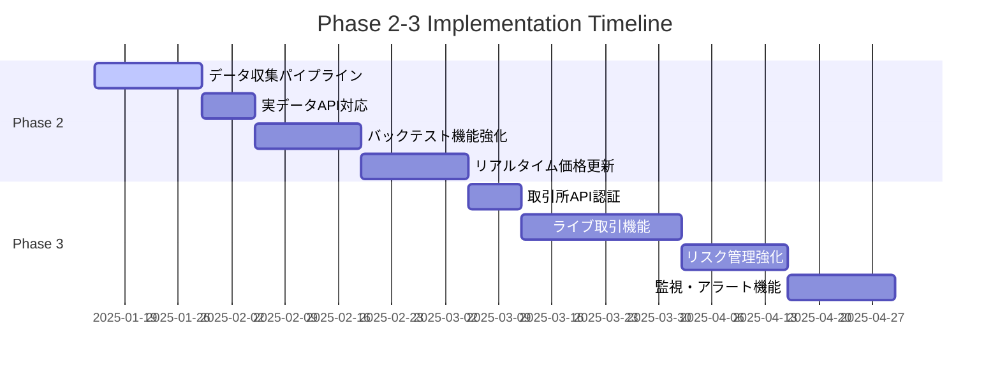

# 🗺️ Phase 2 & 3 Implementation Roadmap

Advanced Crypto Trading BotのPhase2以降の詳細実装計画です。

## 📅 実装タイムライン



## 🎯 Phase 2: データパイプライン & バックテスト強化

### 2.1 データ収集パイプラインの構築 【高優先度】

**目標**: 取引所APIから価格データを自動取得し、Supabaseに保存

#### 実装内容

1. **取引所データ収集器の作成**

   ```python
   # backend/data_pipeline/collectors/
   ├── __init__.py
   ├── base_collector.py      # 抽象基底クラス
   ├── binance_collector.py   # Binance専用
   └── bybit_collector.py     # Bybit専用
   ```

2. **データベーススキーマ設計**

   ```sql
   -- OHLCV価格データテーブル
   CREATE TABLE price_data (
       id BIGSERIAL PRIMARY KEY,
       exchange VARCHAR(20) NOT NULL,
       symbol VARCHAR(20) NOT NULL,
       timeframe VARCHAR(10) NOT NULL,
       timestamp TIMESTAMPTZ NOT NULL,
       open_price DECIMAL(20,8) NOT NULL,
       high_price DECIMAL(20,8) NOT NULL,
       low_price DECIMAL(20,8) NOT NULL,
       close_price DECIMAL(20,8) NOT NULL,
       volume DECIMAL(20,8) NOT NULL,
       created_at TIMESTAMPTZ DEFAULT NOW(),
       UNIQUE(exchange, symbol, timeframe, timestamp)
   );
   ```

3. **スケジューラー実装**

   ```python
   # backend/data_pipeline/scheduler.py
   from celery import Celery
   from .collectors import BinanceCollector, BybitCollector

   @celery.task
   def collect_price_data():
       symbols = ['BTCUSDT', 'ETHUSDT', 'ADAUSDT']
       for symbol in symbols:
           BinanceCollector().collect(symbol)
           BybitCollector().collect(symbol)
   ```

#### 🎯 受け入れ条件

- [ ] 1分足データの自動取得
- [ ] データ重複の防止
- [ ] エラーハンドリング（API制限、ネットワークエラー）
- [ ] ログ記録とモニタリング

#### 📝 実装手順

1. `backend/data_pipeline/collectors/base_collector.py`作成
2. Binance/Bybit個別コレクター実装
3. Supabaseテーブル作成とマイグレーション
4. Celeryタスク設定
5. テスト用データ収集実行

---

### 2.2 APIエンドポイントの実データ対応 【中優先度】

**目標**: モックデータから実際のデータベースデータへ移行

#### 実装内容

1. **trades.pyの更新**

   ```python
   # Before: モックデータ
   fake_trades = generate_fake_trades()

   # After: 実データ
   trades = db.query(Trade).filter(Trade.user_id == user_id).all()
   ```

2. **backtest.pyの更新**

   ```python
   # Before: サンプルデータ
   sample_data = get_sample_ohlcv()

   # After: 実データ
   price_data = db.query(PriceData).filter(
       PriceData.symbol == symbol,
       PriceData.timeframe == timeframe
   ).all()
   ```

#### 🎯 受け入れ条件

- [ ] 全APIエンドポイントが実データを返す
- [ ] レスポンス時間が許容範囲内（<500ms）
- [ ] エラーハンドリング完備
- [ ] API文書の更新

---

### 2.3 バックテスト機能の動作確認と改善 【中優先度】

**目標**: バックテストエンジンの最適化と新機能追加

#### 実装内容

1. **パフォーマンス最適化**
   - データ読み込み最適化（バッチ処理）
   - 計算処理の並列化
   - メモリ使用量削減

2. **新機能追加**

   ```python
   # パラメータ最適化機能
   class ParameterOptimizer:
       def optimize(self, strategy, param_ranges, data):
           # グリッドサーチまたはベイズ最適化

   # 詳細レポート生成
   class BacktestReporter:
       def generate_report(self, results):
           # シャープレシオ、最大ドローダウンなど
   ```

#### 🎯 受け入れ条件

- [ ] バックテスト実行時間短縮（50%以上）
- [ ] パラメータ最適化機能
- [ ] 詳細パフォーマンスレポート
- [ ] 結果の可視化機能

---

### 2.4 リアルタイム価格更新 【中優先度】

**目標**: WebSocket接続でリアルタイム価格表示

#### 実装内容

1. **バックエンドWebSocket**

   ```python
   # backend/api/websocket.py
   @app.websocket("/ws/prices/{symbol}")
   async def price_websocket(websocket: WebSocket, symbol: str):
       await websocket.accept()
       while True:
           price_data = await get_latest_price(symbol)
           await websocket.send_json(price_data)
   ```

2. **フロントエンド実装**

   ```typescript
   // frontend/hooks/useRealtimePrice.ts
   export const useRealtimePrice = (symbol: string) => {
     const [price, setPrice] = useState(null);

     useEffect(() => {
       const ws = new WebSocket(`ws://localhost:8000/ws/prices/${symbol}`);
       ws.onmessage = (event) => setPrice(JSON.parse(event.data));
       return () => ws.close();
     }, [symbol]);

     return price;
   };
   ```

#### 🎯 受け入れ条件

- [ ] リアルタイム価格表示（遅延<1秒）
- [ ] WebSocket接続の安定性
- [ ] 複数通貨ペア対応
- [ ] モバイル対応

## 🚀 Phase 3: ライブ取引・リスク管理

### 3.1 取引所API認証の実装 【中優先度】

**目標**: 実際の取引所アカウントとの安全な連携

#### 実装内容

1. **APIキー管理**

   ```python
   # backend/core/exchange_auth.py
   class ExchangeAPIManager:
       def encrypt_api_key(self, user_id: int, exchange: str, api_key: str):
           # AES暗号化でAPIキーを保存

       def get_authenticated_client(self, user_id: int, exchange: str):
           # 復号してクライアント作成
   ```

2. **セキュリティ強化**
   - APIキーの暗号化保存
   - IP制限設定推奨
   - 権限最小化（読み取り専用推奨）

#### 🎯 受け入れ条件

- [ ] 安全なAPIキー保存
- [ ] 複数取引所対応
- [ ] 権限管理機能
- [ ] セキュリティ監査ログ

---

### 3.2 ライブ取引機能の実装 【低優先度】

**目標**: 実際の注文執行機能（⚠️十分なテスト後）

#### 実装内容

1. **注文執行エンジン**

   ```python
   # backend/trading/live_engine.py
   class LiveTradingEngine:
       def place_order(self, strategy_signal, risk_params):
           # リスク確認 → 注文サイズ計算 → 注文執行

       def monitor_positions(self):
           # ポジション監視とストップロス実行
   ```

2. **安全機能**
   - デモモード（ペーパートレード）
   - 取引制限設定
   - 緊急停止機能

#### 🎯 受け入れ条件

- [ ] デモモードでの完全テスト
- [ ] リスク制限機能
- [ ] 緊急停止機能
- [ ] 取引履歴記録

#### ⚠️ **重要な注意事項**

**ライブ取引は十分なテストなしに有効化してはいけません:**

1. デモ環境で最低30日間のテスト
2. 小額での段階的導入
3. 複数の安全装置の確認

---

### 3.3 リスク管理機能の強化 【低優先度】

**目標**: 包括的なリスク管理システム

#### 実装内容

1. **ポジションサイジング**

   ```python
   class PositionSizer:
       def calculate_size(self, account_balance, risk_per_trade, stop_loss_distance):
           # ケリー基準またはリスクベースサイジング
   ```

2. **リスク監視**
   - 最大ドローダウン制限
   - 日次損失制限
   - 相関リスク管理

#### 🎯 受け入れ条件

- [ ] 自動ポジションサイジング
- [ ] リアルタイムリスク監視
- [ ] アラート機能
- [ ] リスクレポート生成

---

### 3.4 モニタリングとアラート機能 【低優先度】

**目標**: 包括的な監視・通知システム

#### 実装内容

1. **アラートシステム**

   ```python
   # backend/monitoring/alerts.py
   class AlertManager:
       def send_slack_alert(self, message):
           # Slack通知

       def send_email_alert(self, message):
           # メール通知
   ```

2. **ダッシュボード**
   - Prometheus + Grafana
   - 取引パフォーマンス監視
   - システム健全性監視

#### 🎯 受け入れ条件

- [ ] リアルタイム監視ダッシュボード
- [ ] 多様な通知チャネル
- [ ] カスタムアラート設定
- [ ] 履歴データ分析

## 📋 実装チェックリスト

### Phase 2 開始前の準備

- [ ] 現在のコードベースの動作確認
- [ ] Supabaseデータベース設計レビュー
- [ ] 取引所API利用制限の確認
- [ ] 開発環境のセットアップ完了

### Phase 3 開始前の準備

- [ ] Phase 2の全機能動作確認
- [ ] セキュリティレビュー実施
- [ ] テスト環境での十分な検証
- [ ] リスク管理方針の策定

## 🔄 継続的改善

### 定期レビューポイント

1. **毎週**: 進捗確認とブロッカー解決
2. **毎月**: パフォーマンス分析と最適化
3. **四半期**: アーキテクチャレビューと技術スタック見直し

### 品質管理

- すべてのPRにコードレビュー必須
- 自動テストカバレッジ80%以上維持
- セキュリティスキャン定期実行

---

**このロードマップは生きたドキュメントです。** プロジェクトの進展に応じて定期的に更新してください。
