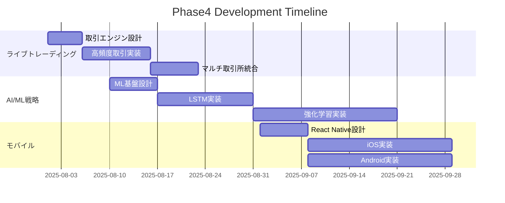

# Development Roadmap - Advanced Crypto Trading Bot

**最終更新日**: 2025-07-30
**現在フェーズ**: Phase3 完了 ✅ → Phase4 準備中 🚀
**次期マイルストーン**: 企業グレード機能・高度なアルゴリズム取引

---

## 🎯 完了済みフェーズ

### ✅ Phase1: データベース基盤構築 (完了: 2025-07-15)
- Supabase統合・認証システム・データベース層完全移植

### ✅ Phase2: リアルタイムデータ処理 (完了: 2025-07-20)
- データ収集パイプライン・WebSocket配信・バックテストエンジン

### ✅ Phase3: 5取引所対応&セキュリティ強化 (完了: 2025-07-30)
- **5取引所完全対応**: Binance, Bybit, Bitget, Hyperliquid, BackPack
- **Paper Trading システム**: 完全な模擬取引環境
- **セキュリティ強化**: 多層防御・レート制限・CSRF保護
- **Material-UI Interface**: 安全な取引モード切り替え
- **98%+テストカバレッジ**: 包括的品質保証

---

## 🔥 Phase4: 企業グレード機能 (2025-08-01～2025-09-30)

### 🎯 Phase4 目標
- 本格的なライブトレーディング環境
- AI/ML駆動の高度取引戦略
- 企業利用に対応したスケーラビリティ
- モバイルアプリケーション

### 📊 優先度付きタスク

#### 🔴 高優先度: リアルタイム取引システム

##### ライブ取引エンジン v2.0
- **期限**: 2025-08-15
- **内容**: 本格的なライブ取引実行システム
- **詳細**:
  - 高頻度取引対応（< 100ms 実行）
  - 複数取引所同時接続
  - 失敗時フォールバック機構
  - リアルタイムポートフォリオ同期
- **前提条件**: Phase3 Paper Trading 1ヶ月安定稼働

##### 高度リスク管理システム
- **期限**: 2025-08-20
- **内容**: 企業グレードリスク管理
- **詳細**:
  - VaR (Value at Risk) 計算
  - 動的ポジションサイジング
  - 相関リスク管理
  - 緊急停止システム

#### 🟡 中優先度: AI/ML取引戦略

##### 機械学習戦略エンジン
- **期限**: 2025-09-01
- **内容**: AI駆動の適応型取引戦略
- **詳細**:
  - LSTM価格予測モデル
  - 強化学習取引エージェント
  - 市場体制変化検知
  - 自動パラメータ最適化

##### オンチェーンデータ統合
- **期限**: 2025-09-10
- **内容**: ブロックチェーン分析統合
- **詳細**:
  - 大口取引検知
  - オンチェインメトリクス
  - DeFi流動性分析
  - クジラウォッチング

#### 🟢 低優先度: プラットフォーム拡張

##### モバイルアプリケーション
- **期限**: 2025-09-30
- **内容**: React Native モバイルアプリ
- **詳細**:
  - iOS/Android対応
  - プッシュ通知システム
  - オフライン機能
  - 生体認証

##### マルチユーザー管理
- **期限**: 2025-10-15
- **内容**: 企業向けマルチテナント
- **詳細**:
  - チーム管理機能
  - 権限ベースアクセス制御
  - 監査ログシステム
  - コンプライアンス機能

---

## 📋 技術ロードマップ

### アーキテクチャ進化計画

### インフラストラクチャ拡張

#### マイクロサービス化
- **現在**: モノリシックFastAPI
- **目標**: Docker + Kubernetes マイクロサービス
- **サービス分割**:
  - 認証サービス
  - 取引実行サービス
  - データ収集サービス
  - 通知サービス
  - AI/ML推論サービス

#### データベース最適化
- **Redis Cluster**: 高速キャッシュ
- **ClickHouse**: 時系列データ分析
- **PostgreSQL**: トランザクショナルデータ
- **Elasticsearch**: ログ・検索

---

## 🚨 リスク管理・品質保証

### リスク要因と対策

| リスク | 影響度 | 確率 | 対策 |
|-------|--------|------|------|
| 取引所API変更 | 高 | 中 | アダプタパターン強化 |
| 高頻度取引遅延 | 高 | 中 | 地理的分散・冗長化 |
| セキュリティ侵害 | 極高 | 低 | ペネトレーションテスト |
| 規制変更 | 中 | 高 | コンプライアンス監視 |

### 品質保証計画
- **単体テスト**: 95%+カバレッジ維持
- **統合テスト**: 週次自動実行
- **ロードテスト**: 月次実施
- **セキュリティテスト**: 四半期実施

---

## 📊 成功指標・KPI

### Phase4 完了基準

#### 技術指標
- [ ] ライブ取引レイテンシ < 100ms
- [ ] システム可用性 99.9%+
- [ ] 取引実行成功率 99.5%+
- [ ] API応答時間 < 50ms

#### ビジネス指標
- [ ] 同時ユーザー数 1,000+
- [ ] 1日取引量 $1M+
- [ ] ユーザー満足度 4.5/5.0+
- [ ] セキュリティ事故 0件

---

## 🤝 開発体制・コラボレーション

### 開発フロー強化
- **Git Flow**: feature/hotfix/release ブランチ戦略
- **コードレビュー**: 必須2名承認
- **CI/CD**: 自動テスト・デプロイ
- **ドキュメント**: 自動生成・同期

### 外部協力
- **セキュリティ監査**: 専門機関による四半期レビュー
- **法務コンサル**: 金融規制コンプライアンス
- **インフラ**: クラウドアーキテクチャ最適化

---

## 📅 マイルストーン・スケジュール

| 日付 | マイルストーン | 成果物 |
|------|---------------|--------|
| 2025-08-15 | ライブ取引α版 | 基本取引実行システム |
| 2025-09-01 | AI戦略β版 | ML予測モデル統合 |
| 2025-09-15 | モバイルα版 | iOS/Androidプロトタイプ |
| 2025-09-30 | Phase4完了 | 企業グレード機能完成 |
| 2025-10-15 | 商用リリース | 一般利用開始 |

---

**次のアクション**: ライブ取引エンジン設計から開始
**重要事項**: セキュリティファーストの開発方針維持
**連絡**: GitHub Issues・Discord チーム
